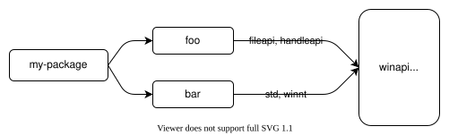

# 特性 {#features}

Cargo 的 "features" 提供了一种表达[条件编译][conditional compilation]和[可选依赖](#optional-dependencies)的机制。包在 `Cargo.toml` 的 `[features]` 表中定义一组具名的功能，每个功能可以被启用或禁用。正在构建的包的功能可以通过命令行标志（如 `--features`）启用。依赖项的功能可以在 `Cargo.toml` 的依赖声明中启用。

> **注意**：现在，发布到 crates.io 上的新 crate 或版本被限制为最多 300 个功能。特殊情况会进行个案审批。详见这篇[博客文章][blog post]。鼓励通过 crates.io Zulip 流参与解决方案讨论。

[blog post]: https://blog.rust-lang.org/2023/10/26/broken-badges-and-23k-keywords.html

也可以参阅[功能特性示例][Features Examples]章节，了解一些如何使用功能的例子。

[conditional compilation]: ../../reference/conditional-compilation.md
[Features Examples]: features-examples.md

## `[features]` 节 {#the-features-section}

功能在 `Cargo.toml` 的 `[features]` 表中定义。每个功能指定一个它所启用的其他功能或可选依赖的数组。下面的示例说明了如何为一个支持不同图像格式的 2D 图像处理库使用功能：

```toml
[features]
# 定义一个名为 `webp` 的功能，该功能不启用任何其他功能。
webp = []
```

定义此功能后，就可以使用 [`cfg` 表达式][`cfg` expressions]在编译时有条件地包含代码以支持请求的功能。例如，包内的 `lib.rs` 可以包含这样的代码：

```rust
// 这有条件地包含一个实现 WEBP 支持的模块。
#[cfg(feature = "webp")]
pub mod webp;
```

Cargo 使用 `rustc` 的 [`--cfg` 标志][`--cfg` flag]来设置包中的功能，代码可以使用 [`cfg` 属性][`cfg` attribute] 或 [`cfg` 宏][`cfg` macro]来测试它们是否存在。

功能可以列出它要启用的其他功能。例如，ICO 图像格式可以包含 BMP 和 PNG 图像，因此当启用它时，应确保也启用这些其他功能：

```toml
[features]
bmp = []
png = []
ico = ["bmp", "png"]
webp = []
```

功能名称可以包含来自 [Unicode XID 标准][Unicode XID standard] 的字符（包含大多数字母），并且另外允许以 `_` 或数字 `0` 到 `9` 开头，第一个字符之后也可以包含 `-`、`+` 或 `.`。

> **注意**：[crates.io] 对功能名称语法有额外限制，要求它们只能是 [ASCII 字母数字][ASCII alphanumeric]字符或 `_`、`-` 或 `+`。

[crates.io]: https://crates.io/
[Unicode XID standard]: https://unicode.org/reports/tr31/
[ASCII alphanumeric]: ../../std/primitive.char.html#method.is_ascii_alphanumeric
[`--cfg` flag]: ../../rustc/command-line-arguments.md#option-cfg
[`cfg` expressions]: ../../reference/conditional-compilation.md
[`cfg` attribute]: ../../reference/conditional-compilation.md#the-cfg-attribute
[`cfg` macro]: ../../std/macro.cfg.html

## `default` 功能 {#the-default-feature}

默认情况下，除非显式启用，否则所有功能都是禁用的。这可以通过指定 `default` 功能来更改：

```toml
[features]
default = ["ico", "webp"]
bmp = []
png = []
ico = ["bmp", "png"]
webp = []
```

构建包时，将启用 `default` 功能，从而启用列出的功能。可以通过以下方式更改此行为：

* `--no-default-features` [命令行标志](#command-line-feature-options)禁用包的默认功能。
* 可以在[依赖声明](#dependency-features)中指定 `default-features = false` 选项。

> **注意**：选择默认功能集时要小心。默认功能是一种便利，使得使用包变得更容易，而无需强迫用户仔细选择要为常见用途启用哪些功能，但也有一些缺点。除非指定了 `default-features = false`，否则依赖项会自动启用默认功能。这可能使得确保默认功能不被启用变得困难，特别是对于在依赖图中出现多次的依赖项。每个包都必须确保指定 `default-features = false` 以避免启用它们。
>
> 另一个问题是，从默认集中移除功能可能是一个[语义化版本不兼容的更改](#semver-compatibility)，因此你应确信会保留这些功能。

## 可选依赖 {#optional-dependencies}

依赖可以标记为 "optional"（可选），这意味着默认情况下它们不会被编译。例如，假设我们的 2D 图像处理库使用一个外部包来处理 GIF 图像。可以这样表达：

```toml
[dependencies]
gif = { version = "0.11.1", optional = true }
```

默认情况下，这个可选依赖会隐式定义一个看起来像这样的功能：

```toml
[features]
gif = ["dep:gif"]
```

这意味着，这个依赖仅当启用了 `gif` 功能时才会被包含。
代码中可以使用相同的 `cfg(feature = "gif")` 语法，并且该依赖可以像任何功能一样被启用，
例如 `--features gif`（请参阅下面的[命令行功能选项](#command-line-feature-options)）。

在某些情况下，你可能不希望公开一个与可选依赖同名的功能。
例如，也许该可选依赖是内部细节，或者你想将多个可选依赖组合在一起，或者你只是想使用一个更好的名称。
如果你在 `[features]` 表的任何地方使用 `dep:` 前缀指定可选依赖，那将会禁用隐式功能。

> **注意**：`dep:` 语法仅从 Rust 1.60 开始可用。更早的版本只能使用隐式功能名称。

例如，为了支持 AVIF 图像格式，假设我们的库需要启用另外两个依赖：

```toml
[dependencies]
ravif = { version = "0.6.3", optional = true }
rgb = { version = "0.8.25", optional = true }

[features]
avif = ["dep:ravif", "dep:rgb"]
```

在这个例子中，`avif` 功能将启用两个列出的依赖。这也避免了创建隐式的 `ravif` 和 `rgb` 功能，因为我们不希望用户单独启用这些功能，因为它们是 crate 的内部细节。

> **注意**：选择性包含依赖的另一种方法是使用[平台特定依赖][platform-specific dependencies]。
> 这些功能不是基于功能，而是基于目标平台的。

[platform-specific dependencies]: specifying-dependencies.md#platform-specific-dependencies

## 依赖的功能 {#dependency-features}

依赖的功能可以在依赖声明中启用。`features` 键指示要启用哪些功能：

```toml
[dependencies]
# 启用 serde 的 `derive` 功能。
serde = { version = "1.0.118", features = ["derive"] }
```

可以使用 `default-features = false` 禁用[`default` 功能](#the-default-feature)：

```toml
[dependencies]
flate2 = { version = "1.0.3", default-features = false, features = ["zlib-rs"] }
```

> **注意**：这可能无法确保默认功能被禁用。如果另一个依赖包含了 `flate2` 但没有指定 `default-features = false`，则默认功能将被启用。关于更多细节，请参阅下面的[功能统一](#feature-unification)。

依赖的功能也可以在 `[features]` 表中启用。语法是 `"package-name/feature-name"`。例如：

```toml
[dependencies]
jpeg-decoder = { version = "0.1.20", default-features = false }

[features]
# 通过启用 jpeg-decoder 的 "rayon" 功能来启用并行处理支持。
parallel = ["jpeg-decoder/rayon"]
```

`"package-name/feature-name"` 语法也会启用 `package-name`（如果它是一个可选依赖）。
这通常不是你想要的。
你可以添加一个 `?`，如 `"package-name?/feature-name"`，这将仅在别的什么东西启用了该可选依赖时才启用给定的功能。

> **注意**：`?` 语法仅从 Rust 1.60 开始可用。

例如，假设我们为我们的库添加了一些序列化支持，并且它需要启用某些可选依赖中的相应功能。
可以这样做：

```toml
[dependencies]
serde = { version = "1.0.133", optional = true }
rgb = { version = "0.8.25", optional = true }

[features]
serde = ["dep:serde", "rgb?/serde"]
```

在这个例子中，启用 `serde` 功能将启用 serde 依赖。
它也将启用 `rgb` 依赖的 `serde` 功能，但仅当别的什么东西已经启用了 `rgb` 依赖时。

## 命令行功能选项 {#command-line-feature-options}

可以使用以下命令行标志来控制启用哪些功能：

* `--features` _FEATURES_: 启用列出的功能。多个功能可以用逗号或空格分隔。如果使用空格，请确保如果从 shell 运行 Cargo，要用引号括住所有功能（例如 `--features "foo bar"`）。如果在[工作空间][workspace]中构建多个包，可以使用 `package-name/feature-name` 语法来指定特定工作空间成员的功能。
* `--all-features`: 激活命令行上选中的所有包的所有功能。
* `--no-default-features`: 不激活所选包的[`default` 功能](#the-default-feature)。

**注意**：请查看各个子命令的文档以获取详细信息。并非所有标志都适用于所有子命令。

[workspace]: workspaces.md

## 功能统一 {#feature-unification}

功能对其定义的包是唯一的。启用一个包的功能不会启用其他包中间名的功能。

当一个依赖被多个包使用时，Cargo 在构建该依赖时将使用所有在该依赖上启用的功能的并集。这有助于确保只使用该依赖的一个副本。更多细节请参见解析器文档的[功能部分][features section]。

例如，让我们看一下使用[大量功能][winapi-features]的 [`winapi`] 包。如果你的包依赖一个启用了 `winapi` 的 "fileapi" 和 "handleapi" 功能的包 `foo`，而另一个依赖 `bar` 启用了 `winapi` 的 "std" 和 "winnt" 功能，那么 `winapi` 将在启用所有这四个功能的情况下被构建。



[`winapi`]: https://crates.io/crates/winapi
[winapi-features]: https://github.com/retep998/winapi-rs/blob/0.3.9/Cargo.toml#L25-L431

这样做的一个后果是功能应该是*增加性的*。也就是说，启用一个功能不应禁用任何功能，并且启用任何功能组合通常应该是安全的。功能不应引入[语义化版本不兼容的更改](#semver-compatibility)。

例如，如果你想选择性地支持 [`no_std`] 环境，**不要**使用 `no_std` 功能。相反，使用一个*启用* `std` 的 `std` 功能。例如：

```rust
#![no_std]

#[cfg(feature = "std")]
extern crate std;

#[cfg(feature = "std")]
pub fn function_that_requires_std() {
    // ...
}
```

[`no_std`]: ../../reference/names/preludes.html#the-no_std-attribute
[features section]: resolver.md#features

### 互斥功能 {#mutually-exclusive-features}

在极少数情况下，功能可能彼此互不兼容。如果可能，应避免这种情况，因为它需要协调依赖图中包的所有使用，以避免同时启用它们。如果不可能，请考虑添加一个编译错误来检测这种情况。例如：

```rust,ignore
#[cfg(all(feature = "foo", feature = "bar"))]
compile_error!("无法同时启用功能 \"foo\" 和功能 \"bar\"");
```

与其使用互斥功能，不如考虑一些其他选项：

* 将功能拆分为单独的包。
* 当存在冲突时，[选择一个功能而非另一个][feature-precedence]。 [`cfg-if`] 包可以帮助编写更复杂的 `cfg` 表达式。
* 架构代码以允许功能并发启用，并使用运行时选项来控制使用哪个功能。例如，使用配置文件、命令行参数或环境变量来选择要启用的行为。

[`cfg-if`]: https://crates.io/crates/cfg-if
[feature-precedence]: features-examples.md#feature-precedence

### 检查已解析的功能 {#inspecting-resolved-features}

在复杂的依赖图中，有时很难理解不同功能如何在各种包上启用。 [`cargo tree`] 命令提供了几个选项来帮助检查和可视化启用了哪些功能。可以尝试的一些选项：

* `cargo tree -e features`: 这将显示依赖图中的功能。每个功能将显示启用了它的包。
* `cargo tree -f "{p} {f}"`: 这是一个更紧凑的视图，显示了在每个包上启用的功能的逗号分隔列表。
* `cargo tree -e features -i foo`: 这将反转树，显示功能如何流入给定的包 "foo"。这可能很有用，因为查看整个图可能会非常庞大且令人不知所措。当你试图弄清楚特定包上启用了哪些功能以及原因时，请使用此选项。请参阅 [`cargo tree`] 页面底部的示例，了解如何阅读此内容。

[`cargo tree`]: ../commands/cargo-tree.md

## 功能解析器第 2 版 {#feature-resolver-version-2}

可以在 `Cargo.toml` 中使用 `resolver` 字段指定不同的功能解析器，如下所示：

```toml
[package]
name = "my-package"
version = "1.0.0"
resolver = "2"
```

有关指定解析器版本的更多详细信息，请参阅[解析器版本][resolver versions]部分。

版本为 `"2"` 的解析器在少数不需要统一功能的情况下避免统一功能。具体情形在[解析器章节][resolver-v2]中描述，简而言之，它在以下情况下避免统一：

* 对于当前未构建的[目标架构][target]所指定的[平台特定依赖][platform-specific dependencies]上启用的功能将被忽略。
* [构建依赖][Build-dependencies]和过程宏不与普通依赖共享功能。
* [开发依赖][Dev-dependencies]不激活功能，除非构建需要它们的 [Cargo 目标][target]（例如测试或示例）。

在某些情况下，避免统一是必要的。例如，如果一个构建依赖启用了 `std` 功能，而同一个依赖在 `no_std` 环境中作为普通依赖使用，启用 `std` 将破坏构建。

然而，一个缺点是，这可能会增加构建时间，因为依赖会被构建多次（每次使用不同功能）。当使用版本 `"2"` 解析器时，建议检查被构建多次的依赖，以减少总体构建时间。如果*不要求*用不同的功能构建这些重复的包，请考虑将功能添加到[依赖声明](#dependency-features)中的 `features` 列表中，以便重复项最终具有相同的功能（从而 Cargo 将只构建它一次）。你可以使用 [`cargo tree --duplicates`][`cargo tree`] 命令检测这些重复依赖。它将显示哪些包被构建了多次；查找列出相同版本的条目。有关获取已解析功能信息的更多信息，请参阅[检查已解析的功能](#inspecting-resolved-features)。对于构建依赖，如果你使用 `--target` 标志进行交叉编译，则没有必要这样做，因为在这种情况下，构建依赖总是与普通依赖分开构建。

[target]: ../appendix/glossary.md#target

### 解析器第 2 版命令行标志 {#resolver-version-2-command-line-flags}

`resolver = "2"` 设置也会改变 `--features` 和 `--no-default-features` [命令行选项](#command-line-feature-options)的行为。

使用版本 `"1"` 时，你只能为当前工作目录中的包启用功能。例如，在一个包含包 `foo` 和 `bar` 的工作空间中，并且你在包 `foo` 的目录中，运行命令 `cargo build -p bar --features bar-feat`，这将失败，因为 `--features` 标志只允许在 `foo` 上启用功能。

使用 `resolver = "2"` 时，功能标志允许为任何通过 `-p` 和 `--workspace` 标志在命令行上选择的包启用功能。例如：

```sh
# 使用 resolver = "2" 时，无论你在哪个目录，此命令都是允许的。
cargo build -p foo -p bar --features foo-feat,bar-feat

# 这个等价的显式形式适用于任何解析器版本：
cargo build -p foo -p bar --features foo/foo-feat,bar/bar-feat
```

此外，对于 `resolver = "1"`，`--no-default-features` 标志仅禁用当前目录中包的默认功能。对于版本 "2"，它将禁用所有工作空间成员的默认功能。

[resolver versions]: resolver.md#resolver-versions
[build-dependencies]: specifying-dependencies.md#build-dependencies
[dev-dependencies]: specifying-dependencies.md#development-dependencies
[resolver-v2]: resolver.md#feature-resolver-version-2

## 构建脚本 {#build-scripts}

[构建脚本][build scripts]可以通过检查 `CARGO_FEATURE_<name>` 环境变量来检测包上启用了哪些功能，其中 `<name>` 是转换为大写且 `-` 转换为 `_` 的功能名称。

[build scripts]: build-scripts.md

## 必需功能 {#required-features}

[`required-features` 字段][`required-features` field]可用于在未启用特定功能时禁用特定的 [Cargo 目标][Cargo targets]。关于更多细节，请参阅链接文档。

[`required-features` field]: cargo-targets.md#the-required-features-field
[Cargo targets]: cargo-targets.md

## 语义化版本兼容性 {#semver-compatibility}

启用一个功能不应引入语义化版本不兼容的更改。例如，该功能不应以可能破坏现有使用的方式更改现有 API。关于哪些更改是兼容的更多细节可以在[语义化版本兼容性章节](semver.md)中找到。

添加和移除功能定义及可选依赖时应小心，因为这些有时可能是向后不兼容的更改。更多细节可以在语义化版本兼容性章节的 [Cargo 部分](semver.md#cargo)找到。简而言之，应遵循以下规则：

* 在次要版本中通常可以安全地进行以下操作：
  * 添加[新功能][cargo-feature-add]或[可选依赖][cargo-dep-add]。
  * [更改依赖上使用的功能][cargo-change-dep-feature]。
* 在次要版本中通常 **不应** 进行以下操作：
  * [移除功能][cargo-feature-remove]或[可选依赖][cargo-remove-opt-dep]。
  * [将现有的公共代码移到功能后面][item-remove]。
  * [从功能列表中移除功能][cargo-feature-remove-another]。

请参阅链接中的注意事项和示例。

[cargo-change-dep-feature]: semver.md#cargo-change-dep-feature
[cargo-dep-add]: semver.md#cargo-dep-add
[cargo-feature-add]: semver.md#cargo-feature-add
[item-remove]: semver.md#item-remove
[cargo-feature-remove]: semver.md#cargo-feature-remove
[cargo-remove-opt-dep]: semver.md#cargo-remove-opt-dep
[cargo-feature-remove-another]: semver.md#cargo-feature-remove-another

## 功能文档和发现 {#feature-documentation-and-discovery}

建议你记录包中可用的功能。这可以通过在 `lib.rs` 顶部添加[文档注释][doc comments]来完成。例如，参见 [regex crate 源代码][regex crate source]，渲染后可以在 [docs.rs][regex-docs-rs] 上查看。如果你有其他文档，例如用户指南，请考虑在那里添加文档（例如，参见 [serde.rs]）。如果你有一个二进制项目，请考虑在项目的 README 或其他文档中记录功能（例如，参见 [sccache]）。

清晰地记录功能可以设定关于哪些功能被视为 "unstable"（不稳定）或不应使用的期望。例如，如果有一个可选依赖，但你不希望用户将其显式列为功能，请将其从记录的功能列表中排除。

发布在 [docs.rs] 上的文档可以使用 `Cargo.toml` 中的元数据来控制构建文档时启用哪些功能。更多详情请参阅 [docs.rs 元数据文档][docs.rs metadata documentation]。

> **注意**：Rustdoc 实验性地支持注解文档，以指示需要使用某些 API 所需的功能。更多细节请参见 [`doc_cfg`] 文档。一个例子是 [`syn` 文档][`syn` documentation]，在那里你可以看到彩色框，注明了使用它所需的功能。

[docs.rs metadata documentation]: https://docs.rs/about/metadata
[docs.rs]: https://docs.rs/
[serde.rs]: https://serde.rs/feature-flags.html
[doc comments]: ../../rustdoc/how-to-write-documentation.html
[regex crate source]: https://github.com/rust-lang/regex/blob/1.4.2/src/lib.rs#L488-L583
[regex-docs-rs]: https://docs.rs/regex/1.4.2/regex/#crate-features
[sccache]: https://github.com/mozilla/sccache/blob/0.2.13/README.md#build-requirements
[`doc_cfg`]: ../../unstable-book/language-features/doc-cfg.html
[`syn` documentation]: https://docs.rs/syn/1.0.54/syn/#modules

### 发现功能 {#discovering-features}

当功能记录在库 API 中时，可以使用户更容易发现哪些功能可用以及它们的作用。如果某个包的功能文档不易获得，你可以查看 `Cargo.toml` 文件，但有时很难追踪到它。 [crates.io] 上的 crate 页面有一个指向源代码仓库的链接（如果可用的话）。像 [`cargo vendor`] 或 [cargo-clone-crate] 这样的工具可以用来下载源代码并检查它。

[`cargo vendor`]: ../commands/cargo-vendor.md
[cargo-clone-crate]: https://crates.io/crates/cargo-clone-crate

## 功能组合 {#feature-combinations}

因为功能是一种条件编译形式，所以需要指数级的配置和测试用例才能实现 100% 的覆盖。默认情况下，测试、文档以及像 [Clippy](https://github.com/rust-lang/rust-clippy) 这样的其他工具，都只会在默认功能集下运行。

我们鼓励你考虑针对不同功能组合的策略和工具——每个项目在时间、资源以及覆盖特定场景的成本效益方面都有不同的要求。常见的配置可能包括启用/禁用默认功能、特定功能组合或所有功能组合。