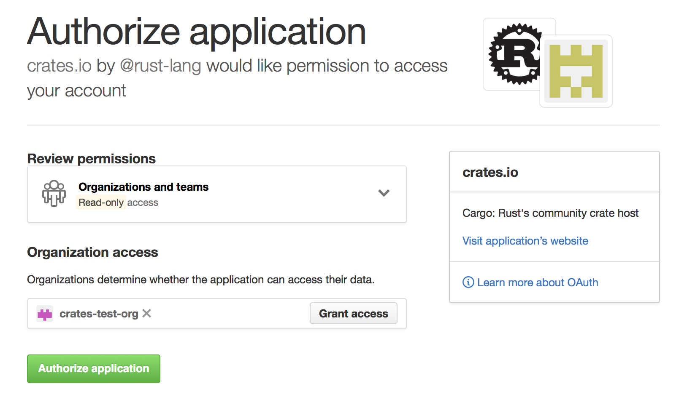

# 在 crates.io 上发布 {#publishing-on-cratesio}

当您有了一个想要与世界共享的库时，是时候在 [crates.io] 上发布它了！发布 crate 是指将特定版本上传到 [crates.io] 进行托管。

发布 crate 时要小心，因为发布是**永久性**的。版本永远不能被覆盖，代码也不能被删除。不过，可以发布的版本数量没有限制。

## 首次发布之前 {#before-your-first-publish}

首先，您需要在 [crates.io] 上注册一个账户以获取 API 令牌。为此，[访问首页][crates.io] 并通过 GitHub 账户登录（目前需要）。您还需要在 [账户设置](https://crates.io/settings/profile) 页面上提供并验证您的电子邮件地址。完成此操作后，[创建一个 API 令牌](https://crates.io/settings/tokens)，确保复制它。一旦离开该页面，您将无法再次看到它。

然后运行 [`cargo login`] 命令。

```console
$ cargo login
```

然后在提示符处输入指定的令牌。
```console
please paste the API Token found on https://crates.io/me below
abcdefghijklmnopqrstuvwxyz012345
```

此命令将告知 Cargo 您的 API 令牌并将其本地存储在 `~/.cargo/credentials.toml` 中。请注意，此令牌是**秘密**，不应与其他人共享。如果因任何原因泄露，您应立即撤销它。

> **注意**：[`cargo logout`] 命令可用于从 `credentials.toml` 中删除令牌。如果您不再需要将其存储在本地机器上，这可能很有用。

## 发布新 crate 之前 {#before-publishing-a-new-crate}

请注意，[crates.io] 上的 crate 名称是按先到先得的原则分配的。一旦一个 crate 名称被占用，就不能用于另一个 crate。

请查看在 `Cargo.toml` 中[可以指定的元数据](manifest.md)以确保您的 crate 更容易被发现！在发布之前，请确保您已填写以下字段：

- [`license` 或 `license-file`]
- [`description`]
- [`homepage`]
- [`repository`]
- [`readme`]

包含一些[`keywords`] 和 [`categories`] 也是个好主意，尽管它们不是必需的。

如果您正在发布一个库，您可能还希望参考 [Rust API 指南]。

### 打包 crate {#packaging-a-crate}

下一步是打包您的 crate 并将其上传到 [crates.io]。为此，我们将使用 [`cargo publish`] 子命令。此命令执行以下步骤：

1. 对您的包执行一些验证检查。
2. 将您的源代码压缩成 `.crate` 文件。
3. 将 `.crate` 文件提取到临时目录并验证其是否编译。
4. 将 `.crate` 文件上传到 [crates.io]。
5. 注册表将在添加上传的包之前执行一些额外的检查。

建议您首先运行 `cargo publish --dry-run`（或等效的 [`cargo package`]）以确保在发布之前没有任何警告或错误。这将执行上面列出的前三个步骤。

```console
$ cargo publish --dry-run
```

您可以在 `target/package` 目录中检查生成的 `.crate` 文件。[crates.io] 目前对 `.crate` 文件有 10MB 的大小限制。您可能希望检查 `.crate` 文件的大小，以确保您没有意外打包不需要构建包的大型资源，例如测试数据、网站文档或代码生成。您可以使用以下命令检查包含了哪些文件：

```console
$ cargo package --list
```

Cargo 在打包时会自动忽略版本控制系统忽略的文件，但如果您想指定一组额外忽略的文件，可以在清单中使用 [`exclude` 键](manifest.md#the-exclude-and-include-fields)：

```toml
[package]
# ...
exclude = [
    "public/assets/*",
    "videos/*",
]
```

如果您希望明确列出要包含的文件，Cargo 还支持 [`include` 键](manifest.md#the-exclude-and-include-fields)，如果设置，它将覆盖 `exclude` 键：

```toml
[package]
# ...
include = [
    "**/*.rs",
]
```

## 上传 crate {#uploading-the-crate}

当您准备好发布时，使用 [`cargo publish`] 命令上传到 [crates.io]：

```console
$ cargo publish
```

就是这样，您现在已经发布了您的第一个 crate！

## 发布现有 crate 的新版本 {#publishing-a-new-version-of-an-existing-crate}

要发布新版本，请更改 `Cargo.toml` 清单中指定的[`version` 值](manifest.md#the-version-field)。请记住[语义化版本规则](semver.md)，它提供了关于什么是兼容性更改的指南。然后运行如上所述的 [`cargo publish`] 以上传新版本。

> **建议：** 考虑完整的发布流程，并尽可能自动化。
>
> 每个版本应包括：
> - 更新日志条目，最好是[手动整理的](https://keepachangelog.com/en/1.0.0/)，尽管生成的也比没有好
> - 指向已发布提交的 [git 标签](https://git-scm.com/book/en/v2/Git-Basics-Tagging)
>
> 代表不同工作流程的第三方工具示例（按字母顺序排列）：
> - [cargo-release](https://crates.io/crates/cargo-release)
> - [cargo-smart-release](https://crates.io/crates/cargo-smart-release)
> - [release-plz](https://crates.io/crates/release-plz)
>
> 更多信息，请参见 [crates.io](https://crates.io/search?q=cargo%20release)。

## 管理基于 crates.io 的 crate {#managing-a-cratesio-based-crate}

crate 的管理主要通过命令行 `cargo` 工具完成，而不是通过 [crates.io] 网络界面。为此，有几个子命令来管理 crate。

### `cargo yank`

有时您可能会发布一个实际上由于某种原因（语法错误、忘记包含文件等）而损坏的 crate 版本。对于这种情况，Cargo 支持对 crate 版本进行“撤回”。

```console
$ cargo yank --version 1.0.1
$ cargo yank --version 1.0.1 --undo
```

撤回**不会**删除任何代码。此功能不适用于删除意外上传的密钥等。如果发生这种情况，您必须立即重置这些密钥。

撤回版本的语义是：不能创建针对该版本的新依赖，但所有现有的依赖继续工作。[crates.io] 的主要目标之一是充当不会随时间改变的 crate 的永久存档，允许删除版本会违背这一目标。本质上，撤回意味着所有具有 `Cargo.lock` 的包都不会损坏，而任何将来生成的 `Cargo.lock` 文件将不会列出被撤回的版本。

### `cargo owner`

一个 crate 通常由多人开发，或者主要维护者可能会随时间变化！crate 的所有者是唯一被允许发布 crate 新版本的人，但所有者可以指定其他所有者。

```console
$ cargo owner --add github-handle
$ cargo owner --remove github-handle
$ cargo owner --add github:rust-lang:owners
$ cargo owner --remove github:rust-lang:owners
```

这些命令的所有者 ID 必须是 GitHub 用户名或 GitHub 团队。

如果给 `--add` 一个用户名，则该用户被邀请为“命名”所有者，拥有对 crate 的完全权限。除了能够发布或撤回 crate 版本外，他们还有能力添加或删除所有者，*包括*使他们成为所有者的所有者。不用说，您不应该让您不完全信任的人成为命名所有者。为了成为命名所有者，用户必须先前登录过 [crates.io]。

如果给 `--add` 一个团队名，则该团队被邀请为“团队”所有者，对 crate 拥有受限权限。虽然他们有权发布或撤回 crate 版本，但他们*没有*能力添加或删除所有者。除了更方便地管理所有者组之外，团队在防止所有者变得恶意方面也更安全一些。

团队的语法目前是 `github:org:team`（请参见上面的示例）。要邀请一个团队作为所有者，您必须是该团队的成员。删除团队作为所有者则没有这样的限制。

## GitHub 权限 {#github-permissions}

团队成员资格不是 GitHub 提供的简单公开访问权限，当您使用它们时可能会遇到以下消息：

> 看起来您没有权限从 GitHub 查询必要属性以完成此请求。您可能需要在 [crates.io] 上重新进行身份验证以授予读取 GitHub 组织成员资格的权限。

这基本上是一个笼统的说法，意思是“您尝试查询一个团队，但五级成员访问控制中的某一个拒绝了此请求”。这并非夸张。GitHub 对团队访问控制的支持是企业级的。

这最可能的原因仅仅是您上次登录是在此功能添加之前。我们最初在验证用户时没有向 GitHub 请求*任何*权限，因为我们实际上从未使用用户的令牌进行除登录之外的任何操作。然而，为了代表您查询团队成员资格，我们现在需要 [`read:org` 作用域][oauth-scopes]。

您可以自由地拒绝我们此作用域，并且在团队功能引入之前的所有功能将继续工作。但是，您将永远无法添加团队作为所有者，或者以团队所有者的身份发布 crate。如果您尝试这样做，您将收到上述错误。如果您尝试发布一个您根本不拥有的 crate，但恰好有一个团队，您可能也会看到此错误。

如果您改变主意，或者只是不确定 [crates.io] 是否有足够的权限，您可以随时访问 <https://crates.io/> 并重新进行身份验证，如果 [crates.io] 没有它想要的所有作用域，它将提示您授权。

查询 GitHub 的另一个障碍是组织可能正在积极拒绝第三方访问。要检查这一点，您可以访问：

```text
https://github.com/organizations/:org/settings/oauth_application_policy
```

其中 `:org` 是组织名称（例如 `rust-lang`）。您可能会看到类似以下内容：


您可以选择从组织黑名单中明确删除 [crates.io]，或者直接按下“移除限制”按钮以允许所有第三方应用程序访问此数据。

或者，当 [crates.io] 请求 `read:org` 作用域时，您可以通过按下其名称旁边的“授予访问”按钮明确允许 [crates.io] 查询相关组织：



### GitHub 团队访问错误排查 {#troubleshooting-github-team-access-errors}

尝试将 GitHub 团队添加为 crate 所有者时，您可能会看到如下错误：

```text
error: failed to invite owners to crate <crate_name>: api errors (status 200 OK): could not find the github team org/repo
```
在这种情况下，您应该访问 [GitHub 应用程序设置页面] 并检查 crates.io 是否列在 `Authorized OAuth Apps` 选项卡中。如果没有，您应该访问 <https://crates.io/> 并授权它。然后返回 GitHub 上的应用程序设置页面，单击列表中的 crates.io 应用程序，并确保您或您的组织列在“组织访问”列表中并带有绿色勾号。如果有标记为 `Grant` 或 `Request` 的按钮，您应该授予访问权限或请求组织所有者这样做。

[Rust API 指南]: https://rust-lang.github.io/api-guidelines/
[`cargo login`]: ../commands/cargo-login.md
[`cargo logout`]: ../commands/cargo-logout.md
[`cargo package`]: ../commands/cargo-package.md
[`cargo publish`]: ../commands/cargo-publish.md
[`categories`]: manifest.md#the-categories-field
[`description`]: manifest.md#the-description-field
[`documentation`]: manifest.md#the-documentation-field
[`homepage`]: manifest.md#the-homepage-field
[`keywords`]: manifest.md#the-keywords-field
[`license` 或 `license-file`]: manifest.md#the-license-and-license-file-fields
[`readme`]: manifest.md#the-readme-field
[`repository`]: manifest.md#the-repository-field
[crates.io]: https://crates.io/
[oauth-scopes]: https://developer.github.com/apps/building-oauth-apps/understanding-scopes-for-oauth-apps/
[GitHub 应用程序设置页面]: https://github.com/settings/applications